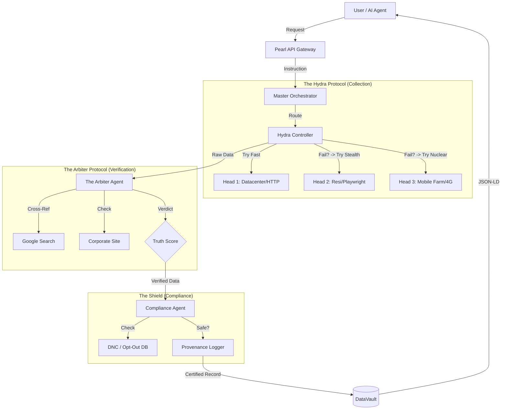

# PEARL DATA INTELLIGENCE - AGENTS & WORKFLOWS
## "The Sensory Nervous System"

---

## 1. AGENT HIERARCHY (THE GODFATHER PROTOCOL)

We do not have "Scrapers." We have **Sensory Agents**.
We do not have "Validators." We have **Arbiters**.

---

## 2. CORE AGENTS SPECIFICATION

### A. THE HYDRA CONTROLLER
**Mission:** "Get the data. No excuses."
**Logic:**
*   Manages the "Threat Level" of a target site.
*   If LinkedIn blocks IP range A, Hydra instantly routes to Provider B.
*   **Self-Healing:** Monitors success rates in real-time. If Head 1 drops below 80% success, it is quarantined.

### B. THE ARBITER AGENT (The Differentiator)
**Mission:** "Trust, but verify."
**Logic:**
*   **Input:** `{ name: "Alice", company: "Nexus", title: "CEO" }`
*   **Action 1:** Search queries: `"Alice Nexus CEO linkedin"`, `"Alice Nexus press release"`.
*   **Action 2:** Analyze "recency" of signals. Did she post yesterday? Or 3 years ago?
*   **Output:** `TruthScore: 0.95` (High Confidence) or `0.10` (Hallucination Risk).

### C. THE COMPLIANCE AGENT
**Mission:** "Protect the Empire."
**Logic:**
*   **The Blacklist:** Checks every extracted email/phone against our internal `opt_out` table.
*   **The Sanitizer:** Strips "Sensitive Personal Information" (SPI) that is not relevant to B2B commerce (e.g., home addresses, health info).
*   **The Notary:** Generates the `provenance_token` signing the data's origin.

---

## 3. KEY WORKFLOWS

### Workflow 1: The "Sensory Feed" Request
1.  **Client** requests: "Get me tech leads in Austin."
2.  **Orchestrator** checks Cache.
    *   *Hit:* Return data instantly (Speed < 200ms).
    *   *Miss:* Dispatch **Hydra**.
3.  **Hydra** collects raw profiles.
4.  **Arbiter** verifies them in parallel (Async).
5.  **Shield** filters the verified list.
6.  **Response:** Delivered to Client with `provenance_id`.

### Workflow 2: The "Opt-Out" Execution
1.  **Individual** submits email at `privacy.pearl.com`.
2.  **Compliance Agent** receives request.
3.  **Action:**
    *   Adds hash to `Global_Blocklist`.
    *   Scans `DataVault` and performs **Hard Delete** of existing records.
    *   Sends confirmation email to Individual.
4.  **Audit Log:** Records the timestamp of compliance for legal cover.

---

## 4. AGENT CONFIGURATION (Technical)

**Stack:**
*   **LangChain / LangGraph:** For agent state management.
*   **Temporal.io:** For durable execution (if Hydra fails, it retries for days if needed).
*   **OpenAI GPT-4o:** For the Arbiter's reasoning engine (parsing messy HTML to find truth).

---

**STATUS:** APPROVED
**CLASSIFICATION:** INTERNAL STRATEGY
